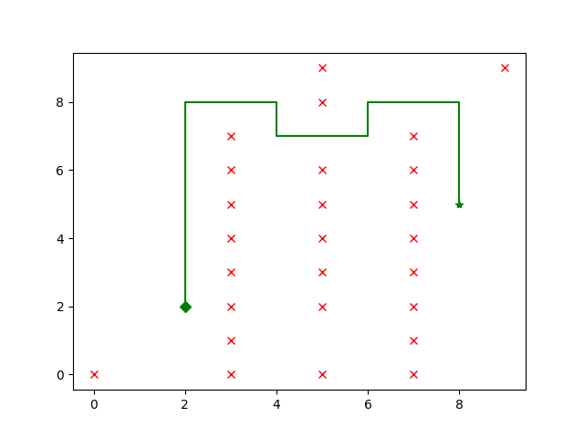
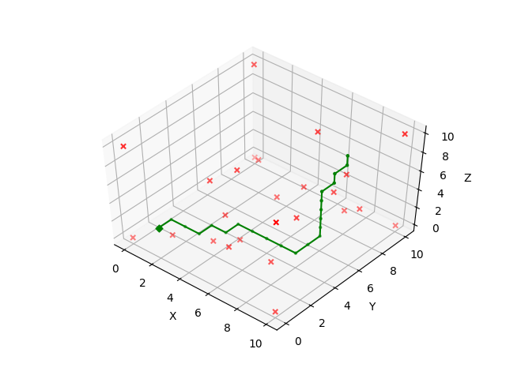

# simpleAstar

### About

Simple A* path finding algorithm implementation for 2D points and 3D point clouds.

 
</a>
</a>

### How to use
Provide an input array of shape (N,2) or a point cloud (N,3). See the test file attached for more information.

##### TODO
Optimize implementation for bigger maps:

- speed-up neighbor search
- avoid sorting each time the open list entries
- use smarter heuristics

### Resources
A* pseudo-code from [wikipedia](https://en.wikipedia.org/wiki/A*_search_algorithm) was used as inspiration for the 2D python implementation, credits goes there.
Another great [source](https://www.redblobgames.com/) for learning about path finding.

/Enjoy